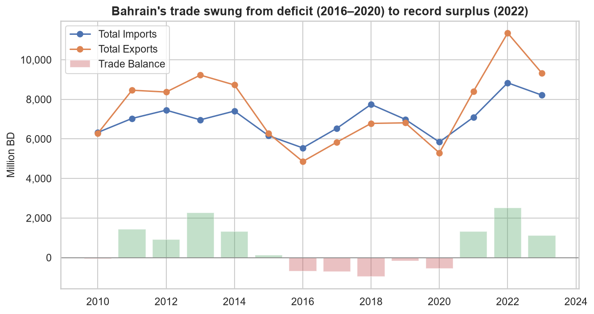
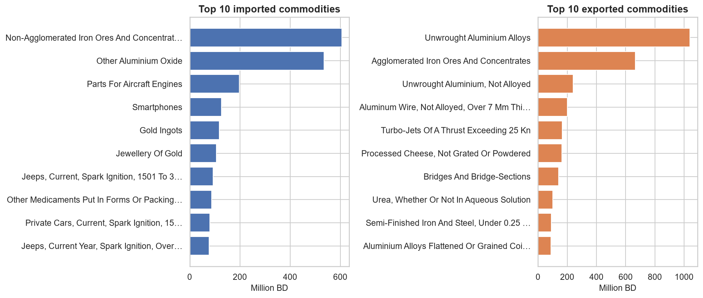

# Bahrain Non-Oil Foreign Trade — Exploratory Data Analysis

**Author:** Aqeel Ebrahim &nbsp;|&nbsp; **Cohort:** Data Science DSB-1 &nbsp;|&nbsp; **Topic 22 — Import & Export (Bahrain)**

---

## Problem Statement
Bahrain reports a headline trade **surplus**, but that number is driven by oil; once oil is excluded the country
runs a **non-oil trade deficit of ≈ 1,190 million BD (2024)**. This project cleans and explores Bahrain's
transaction-level non-oil trade records to reveal **which commodities and partners drive trade, how concentrated
and seasonal it is, and how it is changing** — an evidence base for economic-diversification decisions under
Vision 2030.

## Executive Summary
Bahrain's overall foreign trade recovered from five consecutive deficit years (2016–2020) to a **record surplus of
+2,516 million BD in 2022**, but these headline figures are heavily influenced by oil. To understand the economy
Bahrain is actually trying to diversify, this analysis focuses on the **non-oil** sector using official
transaction-level data (≈ 763,000 import/export records for 2023–2024) alongside the 2010–2023 annual summary,
all sourced from the Bahrain Open Data Portal.

After standardising six inconsistently-formatted files (different column names, an Arabic-transliterated schema,
missing `year` fields, duplicate Arabic columns, and a conflicting `Trade Balance`/`Trade balance` label that we
**recompute** from first principles), the cleaned data tells a clear story. Excluding oil, Bahrain **imported
≈ 5,872 million BD but exported only ≈ 4,682 million BD in 2024 — a non-oil deficit of ≈ 1,190 million BD**.
About **83% of exports are national-origin** (genuinely made in Bahrain) rather than re-exports. The non-oil
economy is a **metals value-chain**: the largest imports are **iron ore and alumina** (raw feedstock) and the
largest exports are **unwrought aluminium and iron/steel products** — Bahrain buys raw materials, refines them with
cheap energy, and sells finished metal.

Trade is **concentrated**: the top-5 destinations (led by **Saudi Arabia and the UAE**) take ≈ 54% of non-oil
exports, and just ≈ 7% of commodity lines account for 80% of import value. Volumes are **seasonally stable** with a
mild December peak, and transaction value is **strongly and significantly correlated** with shipment weight
(Pearson r ≈ 0.79, p ≈ 0). The recommendations focus on targeting the non-oil deficit through import-substitution,
deepening the aluminium/steel value-chain, and diversifying export destinations.

## File Directory
```
Aqeel_Ebrahim_EDA_Project/
├── README.md                                  <- this file
├── Aqeel_Ebrahim_EDA_Project_Notebook.ipynb   <- main technical report (EDA)
├── requirements.txt                           <- Python dependencies
├── data/
│   ├── raw/                                    <- original downloads (data.gov.bh)
│   └── cleaned/                                <- cleaned & aggregated CSV outputs
├── images/                                     <- charts exported by the notebook
├── presentation/
│   ├── Aqeel_Ebrahim_EDA_Project_Presentation.pdf    <- non-technical slide deck
│   └── Aqeel_Ebrahim_EDA_Project_Presentation.pptx    <- editable source
├── streamlit_app/
│   └── app.py                                  <- interactive dashboard
└── scratch/
    └── data_download.py                        <- utility used once to fetch raw data
```

## Data & Data Dictionary
**Source:** [Bahrain Open Data Portal — Foreign Trade theme](https://www.data.gov.bh/explore/?refine.theme=Foreign+Trade)
(Information & eGovernment Authority), retrieved via the OpenDataSoft Explore API. Raw import files are large
(~320k rows / ~80 MB each); they can be re-downloaded with `scratch/data_download.py`.

Datasets used: annual foreign-trade summary (2010–2023); non-oil transaction files for imports, total exports,
national-origin exports and re-exports (2023 & 2024).

**Cleaned transaction schema** (`flow` ∈ Import / Total Export / National Export / Re-export):

| Column | Description |
|---|---|
| `year`, `month_num`, `month_name` | Period of the transaction |
| `commodity_no` | HS commodity code (string; leading zeros preserved) |
| `commodity` | Commodity description (English) |
| `hs_chapter` | **Engineered** — HS chapter (first 2 digits of `commodity_no`) |
| `un_code`, `country_name` | Partner country (ISO code + name) |
| `value_bd`, `value_usa` | Trade value in Bahraini Dinar and US Dollar |
| `weight_kg`, `quantity`, `um` | Shipment weight, quantity and unit of measure |
| `flow` | **Engineered** — trade-flow label |

## Conclusions & Recommendations
- **Target the non-oil deficit through import-substitution** in the largest import lines (iron ore, alumina,
  vehicles, electronics) where domestic or regional value-addition is feasible.
- **Deepen the aluminium & steel value-chain** — already Bahrain's export engine; expanding downstream products
  raises export value without new raw-material dependence.
- **Diversify export destinations** beyond Saudi Arabia and the UAE (top-5 ≈ 54%) to reduce concentration risk.
- **Monitor the concentrated commodity set** (~7% of lines = 80% of value) as a leading indicator of industrial
  demand shifts.

## Areas for Further Research
- Extend the transaction analysis across **2020–2026** for a full multi-year panel.
- Incorporate **oil-trade** data to reconcile the non-oil view with headline totals.
- Adjust monetary values for **inflation** to compare real trade volumes.
- Add trade-agreement / distance / GDP data for a **gravity-model** extension of partner analysis.

## Key Visualizations
| Long-term trade balance | Non-oil metals value-chain |
|---|---|
|  |  |

## How to Reproduce
```bash
pip install -r requirements.txt
python scratch/data_download.py                 # downloads raw data into data/raw/
jupyter notebook Aqeel_Ebrahim_EDA_Project_Notebook.ipynb   # Kernel > Restart & Run All
streamlit run streamlit_app/app.py              # launch the interactive dashboard
```

## Sources
- Kingdom of Bahrain Open Data Portal — Foreign Trade datasets: https://www.data.gov.bh/explore/?refine.theme=Foreign+Trade
- Information & eGovernment Authority (iGA), Kingdom of Bahrain.
- Financial Times *Visual Vocabulary* (chart-type selection guide).
